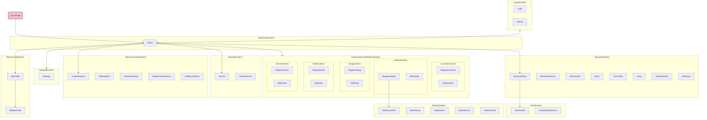

```mermaid

graph TD;
    LaunchApp(LaunchApp)
    style LaunchApp fill:#ffc0cb,stroke:#333,stroke-width:2px,color:#333

    subgraph LoginScreens
        Login[Login]
        Signup[Signup]
    end
    subgraph BrowsingScreens
        Home[Home]
    end
    subgraph SessionScreens
        SessionDetail[SessionDetail]
        SessionEntryList[SessionEntryList]
        JoinSession[JoinSession]
        Entry[Entry]
        TimeTable[TimeTable]
        Party[Party]
        RegisterParty[RegisterParty]
        EditParty[EditParty]
    end
    subgraph SearchScreens
        Search[Search]
        SearchResult[SearchResult]
    end
    subgraph SessionCreateScreens
        CreateSession[CreateSession]
        EditSession[EditSession]
        SessionPartList[SessionPartList]
        RegisterSessionPart[RegisterSessionPart]
        EditSessionPart[EditSessionPart]
    end
    subgraph MyAccountScreens
        MyProfile[MyProfile]
        EditMyProfile[EditMyProfile]
    end
    subgraph UserScreens
        UserProfile[UserProfile]
        FollowAndFollowers[FollowAndFollowers]
    end
    subgraph SettingsScreens
        Settings[Settings]
    end
    subgraph CommunityContributionScreens
        subgraph LocationScreens
            RegisterLocation[RegisterLocation]
            EditLocation[EditLocation]
        end
        subgraph StudioScreens
            RegisterStudio[RegisterStudio]
            EditStudio[EditStudio]
        end
        subgraph SongScreens
            RegisterSong[RegisterSong]
            EditSong[EditSong]
        end
        subgraph ArtistScreens
            RegisterArtist[RegisterArtist]
            EditArtist[EditArtist]
        end
        subgraph GenreScreens
            RegisterGenre[RegisterGenre]
            EditGenre[EditGenre]
        end
    end
    subgraph SelectScreens
        SelectLocation[SelectLocation]
        SelectSong[SelectSong]
        SelectArtist[SelectArtist]
        SelectGenre[SelectGenre]
        SelectStudio[SelectStudio]
    end

LaunchApp-->Home;

LoginScreens<-->Home;

Home-->SessionDetail;
Home-->MyProfile;
Home-->CreateSession;
Home-->Search;
Home-->SettingsScreens;
Home-->CommunityContributionScreens;

MyProfile-->EditMyProfile;
SessionDetail --> UserProfile;


RegisterStudio-->SelectLocation;
```
